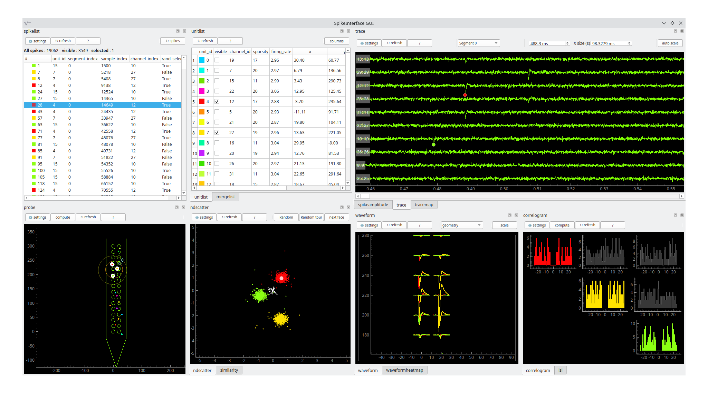

# spikeinterface-gui

GUI for spikeinterface objects without data copy.

This is a cross platform interactive viewer to inspect the final results
and quality of any spike sorter supported by spikeinterface 
(kilosort, spykingcircus, tridesclous, mountainssort, yass, ironclust, herdingspikes, hdsort, klusta...)

This interactive GUI offer several views that dynamically refresh other views.
This allows us to very quickly check the strengths and weaknesses of any sorter output.

Contrary to other viewers (like phy), this viewer skips the tedious and long step of
copying and reformatting the entire dataset (filtered signal + waveform + PCA) to a particular
format or folder organisation. This gui is built on top of spikeinterface objects
(Recording, Sorting, SortingAnalyzer)
These objects are "lazy" and retrieve data on the fly (no copy!).


This viewer internally use Qt (with PySide6, PyQT6 or PyQt5) and pyqtgraph.
And so, this viewer is a local desktop app (old school!!).
There is a web based viewer [here](https://github.com/magland/sortingview).




## main usage

The main idea is make visible one or several unit and visualy inspect if they should be merge or remove.
For this visibility:
  * ctlr + double click on a unit in *probeview*
  * check the box visible in the *unitlist* 
  * double click on one unit in *unitlist* unit visible alone
  * move one of the roi in the *probeview*

Views can be reorganized by moving docks by clicking in the title bar of a docks.
Any dock (view) can be closed. And can be put back with right click in any title bar of any dock.

Every view has a **?** button which open the contextual help. **Theses inplace docs are the most important stuff to be read**. (but the contains typos)

When some units are visible, the related spike list can be refresh.
Then selecting spike per spike can also refersh some views.
This enable a very quick and convinient spike per spike jump on traces.

Channel visibility can be handled with one of the roi in the probeview.


## curation mode

By default this tools is a viewer only. But you can turn it into a tools for manual curation using,
the `curation=True` option.
This tools supoort the [curation format from spikeinterface](https://spikeinterface.readthedocs.io/en/latest/modules/curation.html#manual-curation).
This format enbale to:
  1. remove units
  2. merge units
  3. create manual labels

When this mode is activated a new view is added on top left to maintain the list of removal and merges.
The curation format can be exported to json.


## Important note

The actual `main` branch is using the new `SortingAnalyzer` object from spikeinterface, so you need at least version **0.101.0** of 
spikeinterface and be familiar with the `SortingAnalyzer` concept.


## Launch

In order to use this viewer you will need to know a bit of [spikeinterface](https://spikeinterface.readthedocs.io/)

### Step 1 : create and compute SortingAnalyzer

You first need to is to get a `SortingAnalyzer` object with spikeinterface.

See help [here](https://spikeinterface.readthedocs.io)

Note that:
  * some extensions are mandatory (unit_location, templates, )
  * some extension are optional
  * the more extensions are computed the more view are displayed


  
Example:

```python
import spikeinterface.full as si
recording = si.read_XXXX('/path/to/my/recording')
recording_filtered = si.bandpass_filter(recording)
sorting = si.run_sorter('YYYYY', recording_filtered)


job_kwargs = dict(n_jobs=-1, progress_bar=True, chunk_duration="1s")

# make the SortingAnalyzer with necessary and some optional extensions
sorting_analyzer = si.create_sorting_analyzer(sorting, recording,
                                              format="binary_folder", folder="/my_sorting_analyzer",
                                              **job_kwargs)
sorting_analyzer.compute("random_spikes", method="uniform", max_spikes_per_unit=500)
sorting_analyzer.compute("waveforms", **job_kwargs)
sorting_analyzer.compute("templates", **job_kwargs)
sorting_analyzer.compute("noise_levels")
sorting_analyzer.compute("unit_locations", method="monopolar_triangulation")
sorting_analyzer.compute("isi_histograms")
sorting_analyzer.compute("correlograms", window_ms=100, bin_ms=5.)
sorting_analyzer.compute("principal_components", n_components=3, mode='by_channel_global', whiten=True, **job_kwargs)
sorting_analyzer.compute("quality_metrics", metric_names=["snr", "firing_rate"])
sorting_analyzer.compute("template_similarity")
sorting_analyzer.compute("spike_amplitudes", **job_kwargs)

```


### Step 2 : open the GUI

With python:

```python
import spikeinterface_gui
# This creates a Qt app
app = spikeinterface_gui.mkQApp() 
# reload the SortingAnalyzer
sorting_analyzer = si.load_sorting_analyzer("/my_sorting_analyzer")
# create the mainwindow and show
win = spikeinterface_gui.MainWindow(sorting_analyzer)
win.show()
# run the main Qt6 loop
app.exec_()
```

Or simpler:

```python
  import spikeinterface.widgets as sw
  sorting_analyzer = load_sorting_analyzer(test_folder / "sorting_analyzer")
  sw.plot_sorting_summary(sorting_analyzer, backend="spikeinterface_gui")
```


With the command line

```bash
sigui /path/for/my/sorting_analyzer
```


The command line support some otions like *--notraces* or *--curation*
```bash
sigui  --no-traces --curation /path/for/my/sorting_analyzer
```


## With curation mode


To open the viewer with curation mode use `curation=True`.

This mode is pretty new and was implemented under kind inducement of friends.
I hope that this could be a fair replacement of `phy`.


```python
import spikeinterface_gui
app = spikeinterface_gui.mkQApp() 
win = spikeinterface_gui.MainWindow(sorting_analyzer, curation=True)
win.show()
app.exec_()
```


```python
  from spikeinterface.widgets import plot_sorting_summary
  sw.plot_sorting_summary(sorting_analyzer, curation=True, backend="spikeinterface_gui")
```

The `curation_dict` can be saved inside the folder of the analyzer (for "binary_folder" or "zarr" format).
Then it is auto-reloaded when the gui is re-opened.


## Install

For beginners or Anaconda users please see our [installation tips](https://github.com/SpikeInterface/spikeinterface/tree/main/installation_tips)
where we provide a yaml for Mac/Windows/Linux to help properly install `spikeinterface` and `spikeinterface-gui` for you in a dedicated
conda environment.

Otherwise, 

You need first to install **one** of these 3 packages (by order of preference):
  * `pip install PySide6` or
  * `pip install PyQt6` or
  * `pip install PyQt5`

From pypi:

```bash
pip install spikeinterface-gui
```

From source:

```bash
git clone https://github.com/SpikeInterface/spikeinterface-gui.git
cd spikeinterface-gui
pip install .
```

## Author

Samuel Garcia, CNRS, Lyon, France

This work is a port of the old `tridesclous.gui` submodule on top of
[spikeinterface](https://github.com/SpikeInterface/spikeinterface).

Contrary, to the spikeinterface package, for the developement of this viewer 
all good practices of coding are deliberately put aside  : no test, no CI, no auto formating, no doc, ... 
Feel free to contribute, it is an open wild zone. Code anarchist are very welcome.
So in this mess, persona non grata : pre-commit, black, pytest fixture, ...
