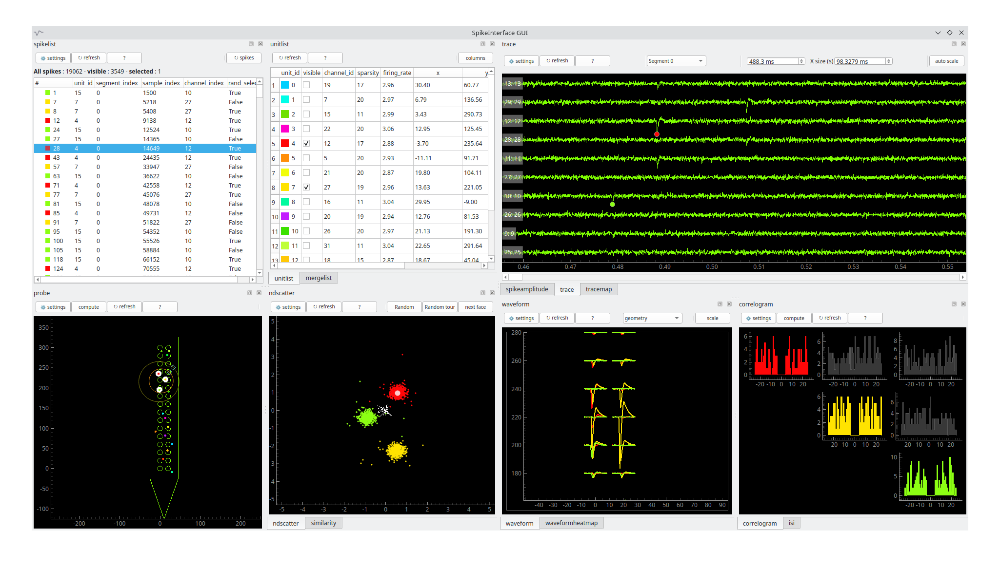
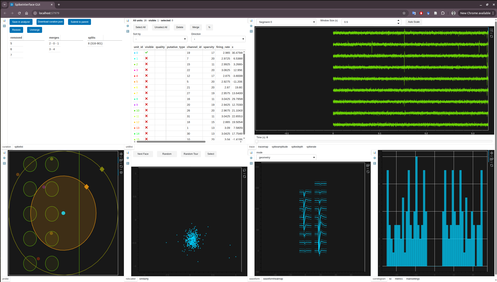
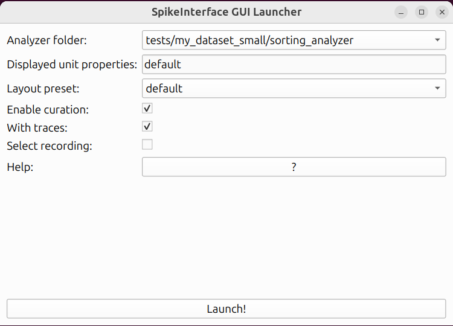
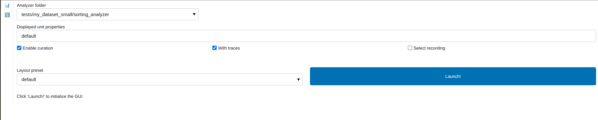

# SpikeInterface-GUI

GUI for the `SortingAnalyzer` object from SpikeInterface.

This is a cross platform interactive viewer to inspect the final results
and quality of any spike sorter supported by `spikeinterface`.

This interactive GUI offers several views that dynamically refresh other views.
This allows us to very quickly check the strengths and weaknesses of any sorter output
and to perform manual curation.

This can be used as a replacement of [phy](https://github.com/cortex-lab/phy).

The documentation is available [here](https://spikeinterface-gui.readthedocs.io).

This viewer has 2 modes:

**mode=desktop** : based on Qt




**mode=web** : based on Panel (can be used remotely)




# Installation

For beginners users, please see our [installation tips](https://github.com/SpikeInterface/spikeinterface/tree/main/installation_tips)
where we provide a yaml for Mac/Windows/Linux to help properly install `spikeinterface` and `spikeinterface-gui` for you in a dedicated
`uv` environment.

In your environment, if you wish to use the Desktop version of the GUI, you can do:

```bash
pip install 'spikeinterface-gui[desktop]'
```

Note: this installs `PySide6`. You can use the `PyQt5` backend instead by uninstalling `PySide6` and then installing `PyQt5`.

If you wish to use the Web version of the GUI, you can do:

```bash
pip install 'spikeinterface-gui[web]'
```

From source:

```bash
git clone https://github.com/SpikeInterface/spikeinterface-gui.git
cd spikeinterface-gui
pip install .
```

You'll then need to install the appropriate backends yourself (`pyqtgraph` and `PySide6` or `PyQt5` for the desktop; `panel` and `bokeh` for web).


# Main usage

The main idea is to make visible one or several units and visually inspect if they should be merged or removed.

For this visibility:

* ctrl + double click on a unit in *probeview*
* check the box visible in the *unitlist* 
* double click on one unit in *unitlist* unit visible alone
* move one of the roi in the *probeview*

Views can be reorganized by moving docks by clicking in the title bar of a docks.
Any dock (view) can be closed. And can be put back with right click in any title bar of any dock.

Every view has a **?** button which opens the contextual help. **These inplace docs are the most important stuff to be read**.

When some units are visible, the related spike list can be refresh.
Then selecting spike per spike can also refresh some views.
This enables a very quick and convenient spike per spike jump on traces.

Channel visibility can be handled with one of the roi in the probeview.

Shortcuts: many shortcuts are available, please read the **?** button in each view.

## Curation mode

By default this tool is a viewer only. But you can turn it into a tool for manual curation using
the `curation=True` option.
This tool supports the [curation format from spikeinterface](https://spikeinterface.readthedocs.io/en/latest/modules/curation.html#manual-curation).
This format enables to:

1. remove units
2. merge units
3. split units
4. create manual labels

When this mode is activated a new view is added on top left to maintain the list of removal and merges.
The curation format can be exported to json.


# Launching the GUI


In order to use this viewer you will need to know a bit of [spikeinterface documentation](https://spikeinterface.readthedocs.io/)

### Step 1: create and compute `SortingAnalyzer`

You first need to get a `SortingAnalyzer` object with spikeinterface.

See help [here](https://spikeinterface.readthedocs.io/)

Note that:

* some extensions are mandatory (unit_location, templates, )
* some extensions are optional
* the more extensions are computed the more views are displayed

Example:

```python

import spikeinterface.full as si
recording = si.read_XXXX('/path/to/my/recording')
recording_filtered = si.bandpass_filter(recording)
sorting = si.run_sorter('YYYYY', recording_filtered)


job_kwargs = dict(n_jobs=-1, progress_bar=True, chunk_duration="1s")

# make the SortingAnalyzer with necessary and some optional extensions
sorting_analyzer = si.create_sorting_analyzer(sorting, recording_filtered,
                                              format="binary_folder", folder="/my_sorting_analyzer",
                                              **job_kwargs)
sorting_analyzer.compute("random_spikes", method="uniform", max_spikes_per_unit=500)
sorting_analyzer.compute("waveforms", **job_kwargs)
sorting_analyzer.compute("templates", **job_kwargs)
sorting_analyzer.compute("noise_levels")
sorting_analyzer.compute("unit_locations", method="monopolar_triangulation")
sorting_analyzer.compute("isi_histograms")
sorting_analyzer.compute("correlograms", window_ms=100, bin_ms=5.)
sorting_analyzer.compute("principal_components", n_components=3, mode='by_channel_global', whiten=True, **job_kwargs)
sorting_analyzer.compute("quality_metrics", metric_names=["snr", "firing_rate"])
sorting_analyzer.compute("template_similarity")
sorting_analyzer.compute("spike_amplitudes", **job_kwargs)
```


### Step 2: open the GUI for one analyzer


With python:

```python
from spikeinterface_gui import run_mainwindow
# reload the SortingAnalyzer
sorting_analyzer = si.load_sorting_analyzer("/my_sorting_analyzer")
# open and run the Qt app
run_mainwindow(sorting_analyzer, mode="desktop", curation=False)
# open and run the Web app with curation activated
run_mainwindow(sorting_analyzer, mode="web", curation=True)
```

Or from spikeinterface:

```python
import spikeinterface.widgets as sw
sorting_analyzer = load_sorting_analyzer(test_folder / "sorting_analyzer")
sw.plot_sorting_summary(sorting_analyzer, backend="spikeinterface_gui")
```

With the command line

```bash
sigui /path/for/my/sorting_analyzer
```

The command line supports some options like *--no-traces* or *--curation* or *--mode*

```bash
sigui --mode=web --no-traces --curation /path/for/my/sorting_analyzer
```

## Running with curation mode


To open the viewer with curation mode use `curation=True`.

```python
from spikeinterface_gui import run_mainwindow
run_mainwindow(sorting_analyzer, curation=True)
```

```python
import spikeinterface.widgets as sw
sw.plot_sorting_summary(sorting_analyzer, curation=True, backend="spikeinterface_gui")
```

The `curation_dict` can be saved inside the folder of the analyzer (for "binary_folder" or "zarr" format).
Then it is auto-reloaded when the gui is re-opened.


## Open the GUI launcher

If you have multiple analyzer folders in the same root folder (or in subfolders), 
you can use the GUI launcher to select which one to open.

```python
from spikeinterface_gui import run_launcher

run_launcher(root_folder="path-to-my-analyzers", mode="desktop")
```

You can also use the command line and just specify the ``--root-folder``:

```bash
sigui --mode=desktop --root-folder path-to-my-analyzers
```



```bash
sigui --mode=web --root-folder path-to-my-analyzers
```



## Customizing the layout

You can create your own custom layout by specifying which views you'd like
to see, and where they go. The basic window layout supports eight "zones",
which are laid out as follows:

```bash
+---------------+--------------+
| zone1   zone2 | zone3  zone4 |
+               +              +
| zone5   zone6 | zone7  zone8 |
+---------------+--------------+
```

If a zone has free space below it or to the right of it, it will try to use it.
Stretching downwards takes precedence over stretching rightwards.
E.g. suppose your layout is only non-empty in zones 1, 4, 5, 6 and 7:

```bash
+---------------+--------------+
| zone1         |        zone4 |
+               +              +
| zone5   zone6 | zone7        |
+---------------+--------------+
```

Then zone1 will stretch right-wards to make a three-zone view. Zone4 will stretch
downwards to make a long two-zone view.

To specify your own layout, put the specification in a `.json` file. This should
be a list of zones, and which views should appear in which zones. An example:

**my_layout.json**

```json
{
    "zone1": ["unitlist", "spikelist"], 
    "zone2": ["spikeamplitude"], 
    "zone3": ["waveform", "waveformheatmap"], 
    "zone4": ["similarity"], 
    "zone5": ["spikedepth"], 
    "zone6": [], 
    "zone7": [], 
    "zone8": ["correlogram"]
}
```

When you open spikeinterface-gui, you can then point to the `my_layout.json`
using the `--layout_file` flag:

```bash
sigui --layout_file=path/to/my_layout.json path/to/sorting_analyzer
```

Find a list of available views [in this file](https://github.com/SpikeInterface/spikeinterface-gui/blob/main/spikeinterface_gui/viewlist.py).


## Deploy the GUI in web mode

The :ref:`launching` section showed how you can launch the GUI on a local workstation.

To recap, you can launch the GUI in web mode by running:

```bash
sigui --mode=web /path/for/my/sorting_analyzer
```

which will start a server on your localhost:


```bash
Launching server at http://localhost:43957
```

However, the GUI can also be deployed on a remote server, and accessed through a web 
browser or directly in the cloud, thanks to its web mode.


### Deploying on a remote lab server

If you want to deploy the GUI on a remote lab server, the GUI can be used by multiple users
with VPN access to the server.

To setup the web GUI on a remote server, follow these steps:

1. Choose a server machine in your lab network (e.g. "my-lab-server") that is accessible through VPN by all lab members.

2. Install spikeinterface-gui and its dependencies on the server machine.

3. Launch the GUI launcher on the server machine with the following command:

```bash
sigui --mode=web --address=auto-ip
```

If all your analyzers will be in the same root folder (or in subfolders), you can also specify the ``--root-folder`` option:

```bash
sigui --mode=web --address=auto-ip --root-folder=/path/to/my/analyzers
```


4. The server will start and display the IP address to access the GUI launcher, e.g.:

```bash
Launching server at http://SERVER.IP.ADDRESS:43957/launcher
```

5. Share the displayed IP address with all lab members, so they can connect to the GUI launcher from their local machines.


## For developers

### Message from dictator (Samuel)

Contrary to the spikeinterface package, for the development of this viewer 
all good practices of coding are deliberately put aside: no test, no CI, no auto formatting, no doc, ... 
Feel free to contribute, it is an open wild zone. Code anarchists are very welcome.
So in this mess, persona non grata: pre-commit, black, pytest fixture, ...


## Credits

Original author: Samuel Garcia, CNRS, Lyon, France

This work is a port of the old `tridesclous.gui` submodule on top of
[spikeinterface](https://github.com/SpikeInterface/spikeinterface).

Main authors and maintainers:

* desktop side: Samuel Garcia, CNRS, Lyon, France
* web side: Alessio Paolo Buccino, Allen Institute for Neural Dynamics, Seattle, USA
* maintainer: Chris Halcrow, University of Edinburgh, Scotland, UK
