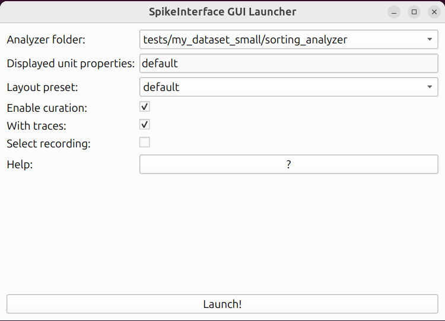

.. _launching:

Launching the GUI
=================

In order to use this viewer you will need to know a bit of `spikeinterface documentation <https://spikeinterface.readthedocs.io/>`_

Step 1: create and compute ``SortingAnalyzer``
^^^^^^^^^^^^^^^^^^^^^^^^^^^^^^^^^^^^^^^^^^^^^^

You first need to get a ``SortingAnalyzer`` object with spikeinterface.

See help `here <https://spikeinterface.readthedocs.io>`_

Note that:

* some extensions are mandatory (unit_location, templates, )
* some extensions are optional
* the more extensions are computed the more views are displayed

Example:

.. code-block:: python

   import spikeinterface.full as si
   recording = si.read_XXXX('/path/to/my/recording')
   recording_filtered = si.bandpass_filter(recording)
   sorting = si.run_sorter('YYYYY', recording_filtered)

   job_kwargs = dict(n_jobs=-1, progress_bar=True, chunk_duration="1s")

   # make the SortingAnalyzer with necessary and some optional extensions
   sorting_analyzer = si.create_sorting_analyzer(sorting, recording_filtered,
                                                 format="binary_folder", folder="/my_sorting_analyzer",
                                                 **job_kwargs)
   sorting_analyzer.compute("random_spikes", method="uniform", max_spikes_per_unit=500)
   sorting_analyzer.compute("waveforms", **job_kwargs)
   sorting_analyzer.compute("templates", **job_kwargs)
   sorting_analyzer.compute("noise_levels")
   sorting_analyzer.compute("unit_locations", method="monopolar_triangulation")
   sorting_analyzer.compute("isi_histograms")
   sorting_analyzer.compute("correlograms", window_ms=100, bin_ms=5.)
   sorting_analyzer.compute("principal_components", n_components=3, mode='by_channel_global', whiten=True, **job_kwargs)
   sorting_analyzer.compute("quality_metrics", metric_names=["snr", "firing_rate"])
   sorting_analyzer.compute("template_similarity")
   sorting_analyzer.compute("spike_amplitudes", **job_kwargs)

Step 2: open the GUI for one analyzer
^^^^^^^^^^^^^^^^^^^^^^^^^^^^^^^^^^^^^

With python:

.. code-block:: python

   from spikeinterface_gui import run_mainwindow
   # reload the SortingAnalyzer
   sorting_analyzer = si.load_sorting_analyzer("/my_sorting_analyzer")
   # open and run the Qt app
   run_mainwindow(sorting_analyzer, mode="desktop", curation=False)
   # open and run the Web app with curation activated
   run_mainwindow(sorting_analyzer, mode="web", curation=True)

Or from spikeinterface:

.. code-block:: python

   import spikeinterface.widgets as sw
   sorting_analyzer = load_sorting_analyzer(test_folder / "sorting_analyzer")
   sw.plot_sorting_summary(sorting_analyzer, backend="spikeinterface_gui")

With the command line

.. code-block:: bash

   sigui /path/for/my/sorting_analyzer

The command line supports some options like *--no-traces* or *--curation* or *--mode*

.. code-block:: bash

   sigui --mode=web --no-traces --curation /path/for/my/sorting_analyzer

Running with curation mode
--------------------------

To open the viewer with curation mode use ``curation=True``.

.. code-block:: python

   from spikeinterface_gui import run_mainwindow
   run_mainwindow(sorting_analyzer, curation=True)

.. code-block:: python

   import spikeinterface.widgets as sw
   sw.plot_sorting_summary(sorting_analyzer, curation=True, backend="spikeinterface_gui")

The `curation_dict` can be saved inside the folder of the analyzer (for "binary_folder" or "zarr" format).
Then it is auto-reloaded when the gui is re-opened.

Open the GUI launcher
---------------------

If you have multiple analyzer folders in the same root folder (or in subfolders), 
you can use the GUI launcher to select which one to open.

.. code-block:: python

   from spikeinterface_gui import run_launcher

   run_launcher(root_folder="path-to-my-analyzers", mode="desktop")

You can also use the command line and just specify the ``--root-folder``:

.. code-block:: bash

   sigui --mode=desktop --root-folder path-to-my-analyzers

.. code-block:: bash

   sigui --mode=web --root-folder path-to-my-analyzers

.. image:: images/launcher_web.png
   :alt: launcher
   :width: 600px
   :align: center